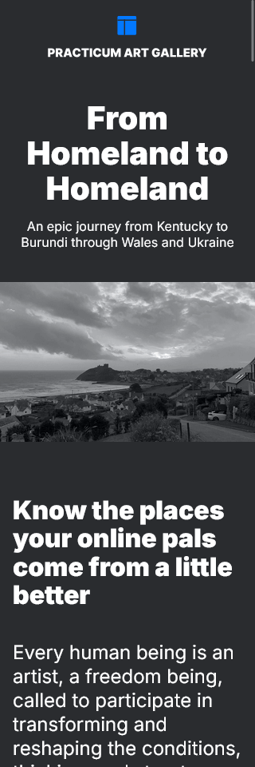
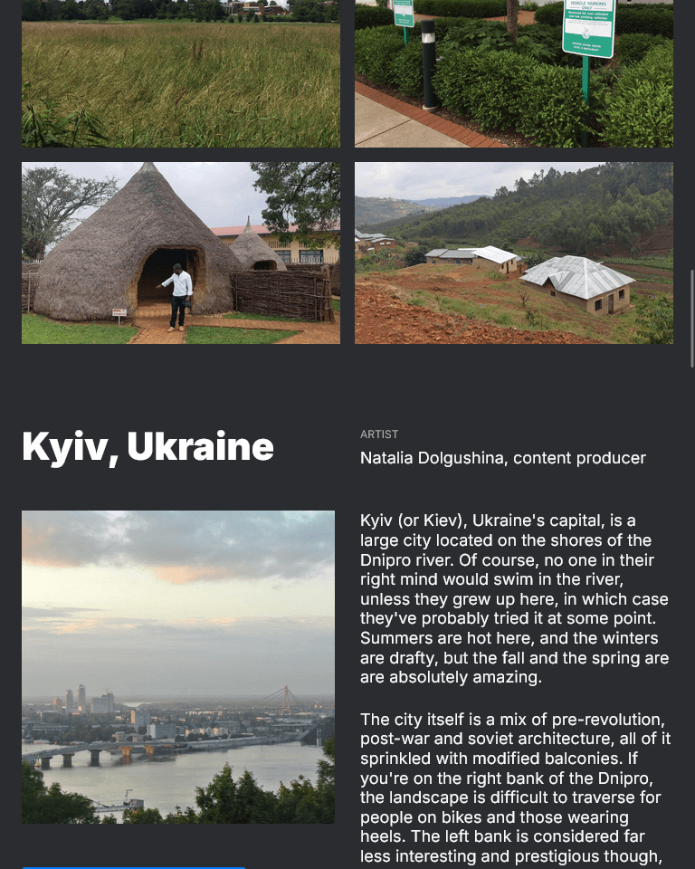
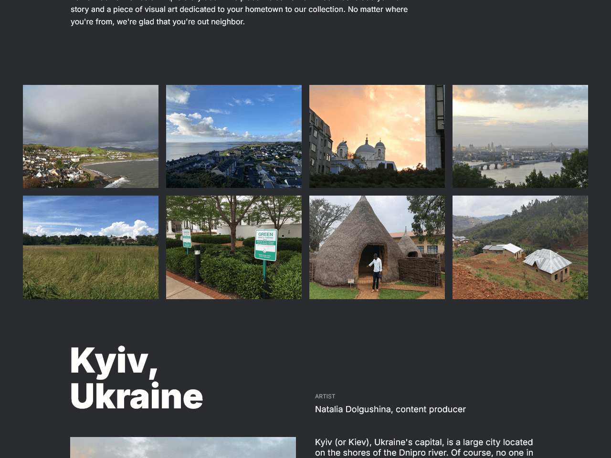

# From Homeland to Homeland

## What is it?

From Homeland to Homeland is a website that journals various places around the world, listing out little factoids about each place for all intrigued and curious minds. It is part of the Practicum (then named [TripleTen](https://tripleten.co.il/)) Art Gallery.

## Techs used

- HTML5
- CSS
- The BEM Methodology (with Flat file structure)
- Semantic markup
- Flex & Grid
- Responsive web design (with Media Queries)

## [Link to website](https://pragmaticLudusian.github.io/web_project_2)

## Resources

- [Figma spec](https://www.figma.com/file/1zCYcflj6BJx5VqOvXU9nb/Sprint-3%3A-From-Homeland-to-Homeland-%7C-desktop-%2B-mobile?node-id=0%3A1)
